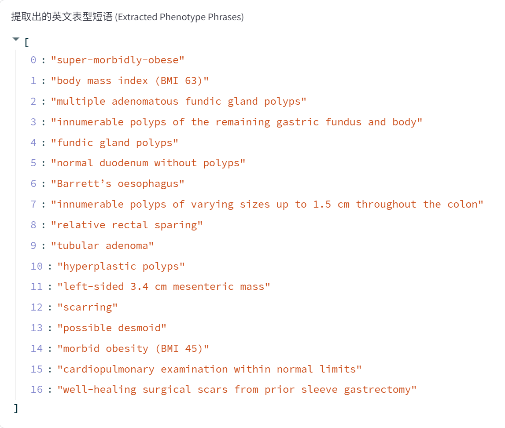
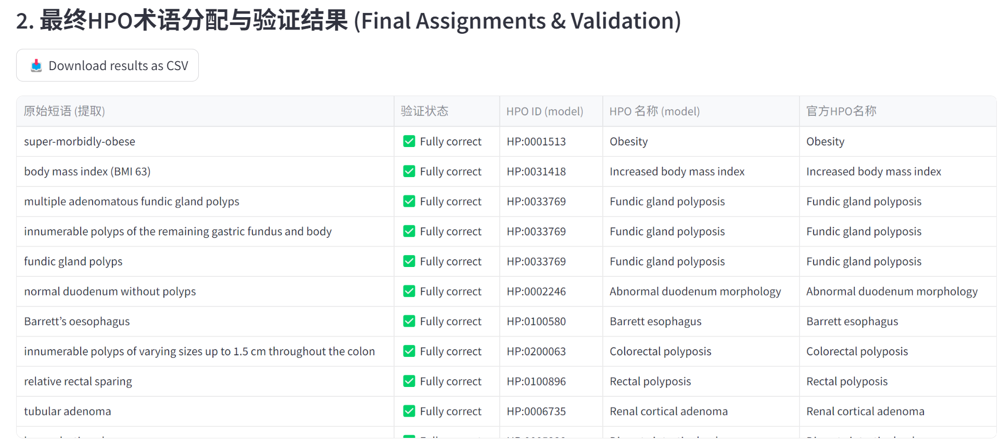

<div align="right">

**English** | [**简体中文**](README.zh-CN.md)

</div>

# PhenoRAG 

[](https://your-streamlit-app-url.streamlit.app/)

**Interactive, Multilingual, and Cloud-Ready: An Advanced Web Application for Real-Time Clinical Phenotype Annotation.**


## 💡 Project Background & Philosophy

This project was inspired by the foundational research of [Garcia et al. in *Genome Medicine*](https://doi.org/10.1186/s13073-025-01521-w) and a personal vision for accessible clinical tools. While the core idea of using RAG to reduce LLM hallucinations in HPO annotation was part of my planned medical doctoral research, I was pleased to see Garcia et al. pioneer this approach and publish their extensive findings. Their work provided significant inspiration for which I am grateful.

This application, while drawing inspiration from their paper, intentionally diverges in its core philosophy and implementation:

-   **Emphasis on Zero-Shot Reasoning**: The original paper describes augmenting their knowledge base with extensive, model-generated synonyms to improve retrieval accuracy. In contrast, **PhenoRAG** is designed to rely more on the zero-shot reasoning capabilities of powerful, large-parameter models (e.g., GPT-5, Claude, Deepseek). I believe extensive data annotation can sometimes run counter to the goal of leveraging the inherent intelligence of these advanced models.
-   **Focus on Accessibility & Visualization**: A key motivation for this project was to create a tool for clinicians and researchers who may lack programming skills. Garcia et al.'s original tool is a command-line utility. **PhenoRAG** provides an interactive, visual interface, making the powerful technology accessible to a broader, non-technical audience.
-   **Use Case Assumption**: HPO annotation often occurs in academic communication or online rare disease diagnostics, where patient phenotype descriptions are typically anonymized. This context mitigates many privacy concerns, allowing for the ethical use of powerful, cloud-based LLMs.

Given the complexity of Garcia et a work, I did not study their code, but inevitably drew inspiration from their published article. I would like to express my gratitude here.

### 📊 Preliminary Performance

A preliminary evaluation of this application was conducted using a 116 cases dataset described by Garcia et al., under DeepSeek-V3 model environment. The results were as follows: **Precision=0.636**, **Recall=0.673**, **F1-Score=0.654** (TP=1208, FP=690, FN=586).

While these metrics are slightly lower than those reported in the original paper, they are considered acceptable given this application's emphasis on ease of use and zero-shot capabilities. Furthermore, even incorrectly assigned HPO terms can still provide valuable clinical context for physicians.

### 📝 A Note on Data Export

After downloading the results as a CSV file, you may need to decide whether to deduplicate HPO terms based on your specific research objectives. The application automatically validates each model-generated HPO term against the official HPO knowledge base, allowing for the detection of model hallucinations. While the rate of hallucination is model-dependent and generally very low, this validation step is crucial for identifying such instances.


### 📊 Pictures






---

## 🚀 Live Demo

**You can access and use the live application here:**

### [**https://your-streamlit-app-url.streamlit.app/**](https://your-streamlit-app-url.streamlit.app/)

*(Note: Please replace the URL above with your actual Streamlit Cloud app URL)*

---

## ✨ Key Features

- **🌐 Multilingual Support**: Handles clinical text in any language by seamlessly translating it to English for analysis.
- **🧠 Advanced RAG-HPO Core**: Implements a robust RAG pipeline to ensure high accuracy and minimize LLM hallucinations.
- **☁️ Cloud-Native**: Deployed on Streamlit Community Cloud for global accessibility with no installation required.
- **🖥️ Interactive & User-Friendly UI**: A clean web interface built with Streamlit providing real-time feedback and clear, verifiable results.
- **✅ Result Validation**: Automatically verifies each assigned HPO term against the official HPO database for instant quality control.
- **🔄 Always Up-to-Date**: The knowledge base is built on-the-fly from the latest official HPO `hp.json`, ensuring data is always current.
- **💾 Data Export**: Download analysis results in CSV format for easy record-keeping and further analysis.
- **🔧 Flexible Backend**: Configurable to work with any OpenAI-compatible LLM API.

## 📖 How to Use the Live App

Using the deployed application is simple:

1.  **Visit the App URL**: Click on the [live demo link](https://your-streamlit-app-url.streamlit.app/) above.
2.  **Configure API in Sidebar**: The app requires an API key to function. 
    -   **If the developer has pre-configured a key**, the app will work out-of-the-box.
    -   **If the API Key field is empty**, you will need to provide your own OpenAI-compatible API key. You can get one from services like SilicoudCloud,Together AI, or OpenAI.
3.  **Select Language**: Choose whether your input text is "English" or "Non-English".
4.  **Input Text**: Paste the patient's clinical description.
5.  **Analyze**: Click the "Start Analysis" button.
6.  **Download**: Once the analysis is complete, you can download the results as a CSV file.

## 🛠️ For Developers: Running Locally or Deploying Your Own Instance

If you want to run the application on your local machine, modify it, or deploy your own version, follow these steps.

### 1. Prerequisites

-   [Git](https://git-scm.com/)
-   [Python](https://www.python.org/downloads/) 3.10

### 2. Installation

Clone the repository and set up the environment:

```bash
# Clone the repository
git clone https://github.com/dukeway/PhenoRAG.git
cd PhenoRAG

# Install dependencies
pip install -r requirements.txt
```

### 3. Data and Model Setup

- **HPO Data**: Download the latest hp.json file from the HPO Website([Human Phenotype Ontology](https://hpo.jax.org/data/ontology) )and **place it in the data/ directory.**
- **Embedding Model**: The application uses the bge-small-en-v1.5 sentence transformer model. It should be automatically downloaded on first run. Alternatively, you can pre-download it and place it in a local_models/ directory.

### 4. Running the Application

Launch the Streamlit app with the following command:

```
streamlit run app.py
```

Your web browser should automatically open a new tab with the application running.

## 🛠️ Technical Stack

- **Backend**: Python
- **Web Framework**: Streamlit
- **AI/ML**:
    - **LLM Interaction**: OpenAI Python library
    - **Vector Search**: FAISS (Facebook AI Similarity Search)
    - **Embeddings**: Sentence-Transformers
- **Data Handling**: Pandas, NumPy

## 📜 License

This project is licensed under the [MIT License](LICENSE).

## 🙏 Acknowledgements

This work is an implementation and extension of the concepts presented in the paper "Improving automated deep phenotyping through large language models using retrieval-augmented generation" by Garcia et al., published in *Genome Medicine*. We are grateful for their foundational research.