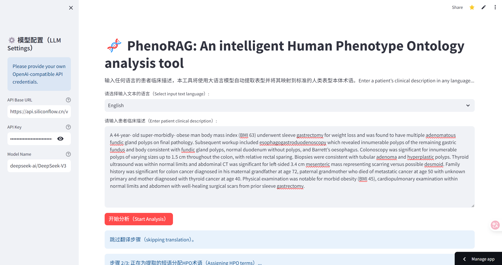
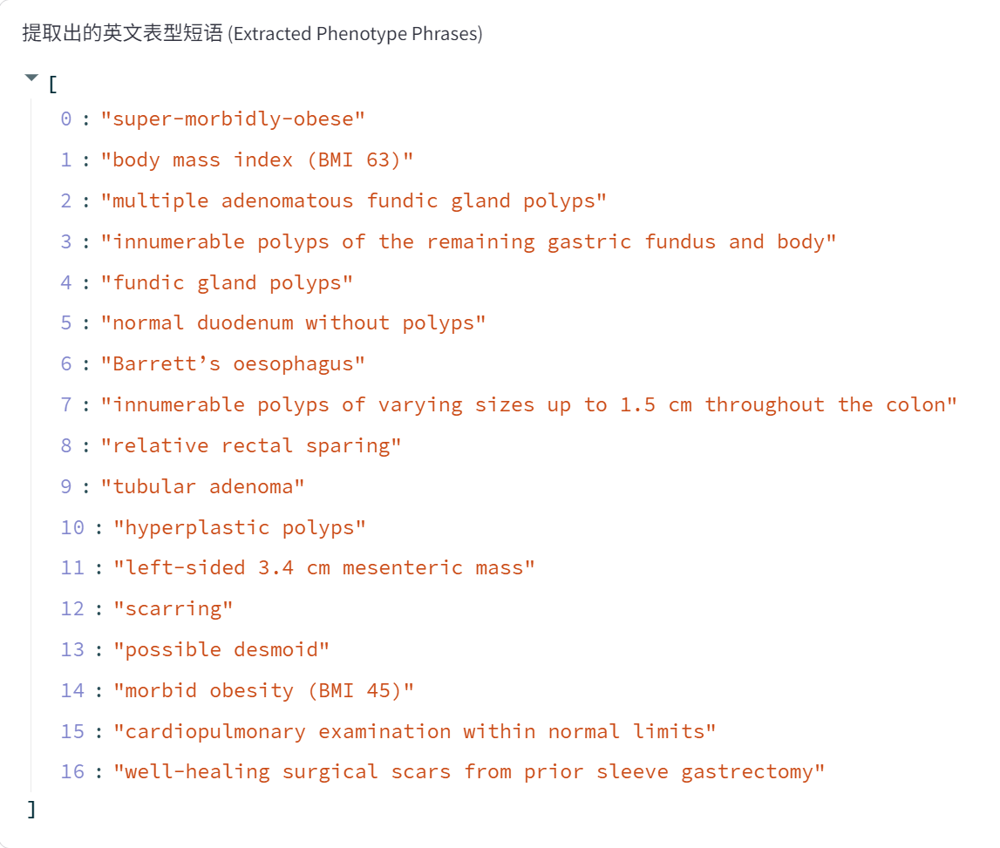
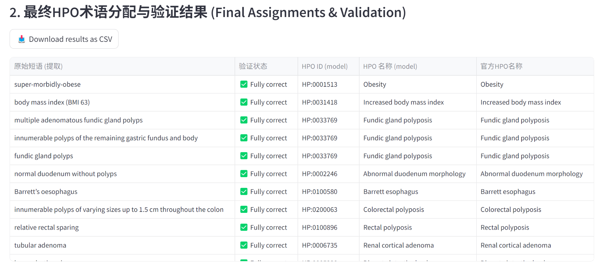

[**English**](README.md) | **简体中文**

</div>

# PhenoRAG 

[](https://phenorag.streamlit.app/)

**一个交互式、多语言、云原生的Web应用，用于实时临床表型注释。**

## 💡 项目背景与理念

本项目的设计灵感源于 [Garcia et al. 在 *Genome Medicine*](https://doi.org/10.1186/s13073-025-01521-w ) 上发表的基础性研究，以及我对开发基于大语言模型易于使用的临床工具的个人愿景。虽然利用RAG技术降低大语言模型在HPO识别中的幻觉率，是我之前在医学博士论文所构想的一小部分工作内容，但我很高兴看到Garcia等人率先实现了这一方法，并在高质量期刊上发表了他们的研究成果，其中包含了大量我未曾预想到的额外工作。他们的工作为我提供了重要的启发，对此我深表感谢。

本应用在借鉴其论文思想的同时，在核心理念和实现方式上采取了不同的路径：

-   **强调零样本推理能力 **: 原论文描述了通过大量模型生成的同义词来增强其知识库，以提高检索准确率。与此不同，**PhenoRAG** 旨在更多地依赖于功能强大的大参数模型（如 GPT-5, Claude, Deepseek）的零样本推理能力。我认为，过度的数据标注有时可能与发挥这些先进模型固有智能的目标背道而驰。
-   **聚焦于可及性与可视化 **: 本项目的一个关键动机是为可能缺乏编程技能的临床医生和研究人员创造一个工具。Garcia等人的原始工具是一个命令行程序。而**PhenoRAG**提供了一个交互式的可视化界面，使得这项强大的技术能够被更广泛的非技术背景的医生用户所使用。
-   **应用场景假设 **: HPO注释经常发生在学术交流或罕见病的在线诊断中，在这些场景下，患者的表型描述通常是匿名的。这种背景在很大程度上减轻了隐私方面的担忧，从而允许我们合乎伦理地使用功能强大的云端大语言模型。

由于Garcia 等人代码的复杂性，我没有研究其代码实现，但不可避免地从其发表的文章中获得了灵感。我愿在此表达我的感激之情。

### 📊 初步性能评估

本应用在DeepSeek-V3模型环境下，使用了一份与Garcia等人所述的116份虚拟病例数据集进行了初步评估。结果如下：**精确率 (Precision)=0.636**，**召回率 (Recall)=0.673**，**F1分数 (F1-Score)=0.654** (TP=1208, FP=690, FN=586)。

虽然这些指标略低于原论文中的报道结果，但考虑到本应用对易用性和零样本能力的侧重，这些结果被认为是可接受的。此外，即使是错误分配的HPO术语，仍然可以为医生提供有价值的临床参考。

### 📝 关于数据导出的说明

在将结果下载为CSV文件后，您可能需要根据具体的研究目的来决定是否对HPO术语进行去重。本应用会自动将模型生成的每个HPO术语与官方HPO知识库进行比对，以检测模型的幻觉情况。虽然幻觉率与所选模型有关且通常非常低，但这一验证步骤对于发现此类实例至关重要。

### 📊 应用截图





---

## 🚀 在线体验

**您可以直接访问并使用在线部署的应用：**

### https://phenorag.streamlit.app/

---

## ✨ 核心功能

- **🌐 多语言支持**: 通过无缝翻译，可处理任何语言的临床文本，在分析前将其转换为英文。
- **🧠 先进的RAG**: 实现了强大的RAG流程，确保HPO术语分配的高准确率，并最大限度地减少大语言模型的幻觉。
- **☁️ 云原生部署**: 部署于Streamlit Community Cloud，无需安装即可全球访问。
- **🖥️ 交互式与用户友好的界面**: 使用Streamlit构建的简洁Web界面，提供实时反馈和清晰、可验证的结果。
- **✅ 结果验证**: 自动将每个分配的HPO术语与官方HPO数据库进行验证，提供即时质量检查。
- **🔄 知识库始终最新**: 知识库是基于最新的官方 `hp.json` 文件动态构建的，确保数据始终保持最新。
- **💾 数据导出**: 支持将分析结果下载为CSV格式，便于记录保存和进一步分析。
- **🔧 灵活的后端**: 可配置以使用任何与OpenAI API兼容的大语言模型服务。

## 📖 如何使用在线应用

1.  **访问应用链接**: 点击上方的 [在线体验链接](https://phenorag.streamlit.app/)。
2.  **在侧边栏配置API**: 本应用需要API密钥才能运行。
    -   默认I密钥字段为空，您需要提供自己的、与OpenAI兼容的API密钥。您可以从硅基流动，DeepSeek等服务商获取。
3.  **选择语言**: 在下拉菜单中选择您的输入文本是“英文”还是“非英文”。
4.  **输入文本**: 将患者的临床描述粘贴到文本区域。
5.  **开始分析**: 点击“开始分析”按钮。
6.  **下载结果**: 分析完成后，您可以将结果下载为CSV文件。

## 🛠️ 开发者指南：本地运行或自行部署

如果您想在本地计算机上运行、修改或部署您自己的版本，请遵循以下步骤。

### 1. 环境要求

-   [Git](https://git-scm.com/)
-   [Python](https://www.python.org/downloads/) 3.10

### 2. 安装步骤

克隆本仓库并设置环境：

```bash
# 克隆仓库
git clone https://github.com/dukeway/PhenoRAG.git
cd PhenoRAG

# 安装依赖
pip install -r requirements.txt
```

### 3. 数据与模型配置

- **HPO数据**: 从 [HPO官网](https://www.google.com/url?sa=E&q=https%3A%2F%2Fhpo.jax.org%2Fapp%2Fdownload%2Fontology) 下载最新的 hp.json 文件，并将其放置在项目根目录下的 data/ 文件夹中。
- **嵌入模型**: 本应用使用 bge-small-en-v1.5 句向量模型。首次运行时，它会自动从Hugging Face下载。或者，您也可以预先下载模型，并将其放置在 local_models/ 目录中（需要相应修改代码）。

### 4. 运行应用

使用以下命令启动Streamlit应用：

```
streamlit run app.py
```

您的Web浏览器应该会自动打开一个新标签页，应用程序正在运行。

您的浏览器将自动打开一个新标签页，并显示正在运行的应用。

## 🛠️ 技术栈

- **后端**: Python
- **Web框架**: Streamlit
- **人工智能/机器学习**:
  - **大语言模型交互**: OpenAI Python library
  - **向量搜索**: FAISS (Facebook AI Similarity Search)
  - **文本嵌入**: Sentence-Transformers
- **数据处理**: Pandas, NumPy

## 📜 开源许可

本项目采用 MIT License开源许可。

## 🙏 致谢

本项目是对 Garcia 等人在 *Genome Medicine* 上发表的论文 "Improving automated deep phenotyping through large language models using retrieval-augmented generation" 中概念的实现和扩展。我们对他们的基础性研究表示衷心的感谢。
