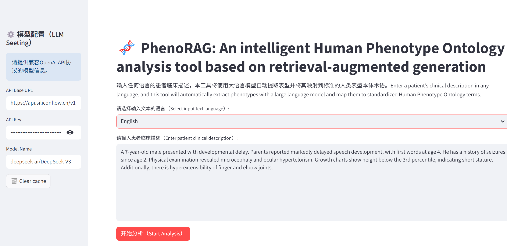
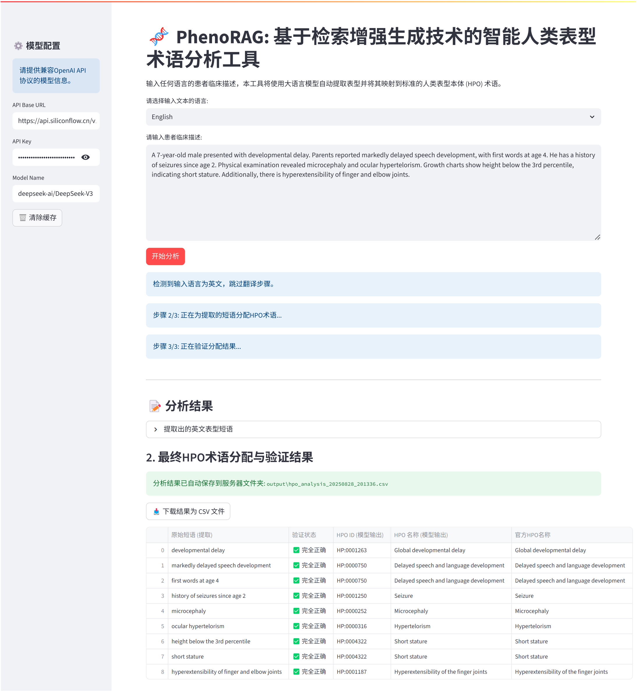

<div align="right">
[**English**](README.md) | **简体中文**

</div>

# PhenoRAG

 一个用户友好的多语言实时表型注释Web应用程序。

PhenoRAG是一个先进的、用户友好的Web应用程序，旨在弥合复杂临床叙述与标准化表型数据之间的差距。利用检索增强生成(RAG)和大语言模型(LLM)的强大功能，该工具能够智能地从任何语言的患者描述中提取临床表型，并准确地将其映射到人类表型本体(HPO)。

我将这个项目部署到Streamlit Cloud，以方便非技术人员的使用。

受到[Garcia等人在《Genome Medicine》期刊](https://doi.org/10.1186/s13073-025-01521-w)研究的启发，该项目将原始的命令行工具转化为交互式的、临床就绪的平台，使临床医生、遗传咨询师和研究人员无需任何编程知识即可进行深度表型分析。

**需要说明的是**，使用RAG以降低LLM识别HPO的幻觉率，是我的医学博士毕业论文中预想的一小部分内容，很高兴看到Garcia等人首先实现了它并且将研究成果发表在了高质量期刊上，并且他们做了大量的我之前没有预想到的额外工作。虽然Garcia等人也开源了类似应用，但这与我预想的方法不一样，因为他们在知识库中增加了大量的近义词以提高模型的检索正确率，并且主要使用了小参数的开源模型Llama3.1-70B（他们认为这种模型在医院本地化部署会有优势）。而我认为更多的数据标注，是和大语言模型的零样本推理能力背道而驰，并且HPO的识别工作，主要发生在学术交流或者在线诊断罕见病。因此患者的疾病表型描述，往往不是隐私和安全问题，我们完全可以使用更大参数的模型如ChatGPT以减少数据标注工作。

更重要的是，Garcia等人的应用还没有做到可视化，这对于很多医生来说，是非常不方便的，因为他们基本不具备编程能力。鉴于他们的工作比较复杂，因此我也没有学习他们的代码，但仍然不可避免的在他们发表的文章中获得灵感。在此处表示感谢。





---

## ✨ 主要特性

- **🌍 多语言支持**: 自动将任何语言（如中文、西班牙语、法语）的临床文本翻译成英语后进行分析，打破语言障碍。
- **🧠 先进的RAG-HPO核心**: 实现强大的RAG，最小化LLM幻觉，在HPO术语分配中实现高精度。
- **🖥️ 交互式用户友好界面**: 使用Streamlit构建的简洁Web界面，提供实时反馈、进度更新和清晰、可验证的结果。
- **✅ 结果验证**: 自动验证每个LLM分配的HPO术语与官方HPO数据库的匹配性，提供即时质量检查（✅ 正确，⚠️ 名称不匹配，❌ 无效ID）。
- **📄 自动化和最新知识库**: 知识库从最新的官方HPO `hp.json`文件自动构建，确保工具始终使用最新的表型数据。
- **💾 数据导出**: 允许用户将分析结果下载为CSV文件，用于记录保存、统计分析或集成到其他系统中。
- **🔧 灵活的后端**: 易于配置，可与任何OpenAI兼容的LLM API（如硅基流动，DeepSeek等）一起工作。

## 🚀 快速开始

按照以下步骤在本地设置和运行应用程序。

### 1. 先决条件

- Python 3.10+
- Git

### 2. 安装

克隆仓库并安装所需依赖：

```bash
# 克隆仓库
git clone https://github.com/dukeway/PhenoRAG.git
cd PhenoRAG

# 安装依赖
pip install -r requirements.txt
```

### 3. 数据和模型设置

- **HPO数据**: 从HPO网站（[人类表型本体](https://hpo.jax.org/data/ontology)）下载最新的hp.json文件，并**将其放置在data/目录中。**
- **嵌入模型**: 应用程序使用bge-small-en-v1.5句子转换器模型。它应该在首次运行时自动下载。或者，您可以预先下载并将其放置在local_models/目录中。

### 4. 配置

在项目根目录中创建.env文件并添加您的LLM API凭据：

```
# .env文件，以硅基流动为为例
API_BASE_URL="https://api.siliconflow.cn/v1"
API_KEY="YOUR_API_KEY_HERE"
LLM_MODEL="deepseek-ai/DeepSeek-V3"
```

### 5. 运行应用程序

使用以下命令启动Streamlit应用：

```
streamlit run app.py
```

您的Web浏览器应该会自动打开一个新标签页，应用程序正在运行。

## 📖 使用方法

1.  **配置API**: 确保您的API凭据在侧边栏中正确输入。
2.  **选择语言**: 从下拉菜单中选择您的输入文本是"英语"还是"非英语"。
3.  **输入文本**: 将患者的临床描述粘贴到文本区域中。
4.  **分析**: 点击"开始分析(Start Analysis)"按钮。
5.  **查看结果**: 应用程序将显示翻译后的文本（如果适用）、提取的表型短语和包含HPO术语分配及其验证状态的最终表格。
6.  **下载**: 点击"Download results as CSV file"按钮将结果保存到您的计算机。

## 🛠️ 技术栈

- **后端**: Python
- **Web框架**: Streamlit
- **AI/ML**:
  - **LLM交互**: OpenAI Python库
  - **向量搜索**: FAISS（Facebook AI相似性搜索）
  - **嵌入**: Sentence-Transformers
- **数据处理**: Pandas、NumPy

## 📜 许可证

该项目在[MIT许可证](LICENSE)下授权。

## 🙏 致谢

这项工作是对Garcia等人在《基因组医学》期刊上发表的论文"Improving automated deep phenotyping through large language models using retrieval-augmented generation"中提出概念的实现和扩展。我们感谢他们的基础研究。